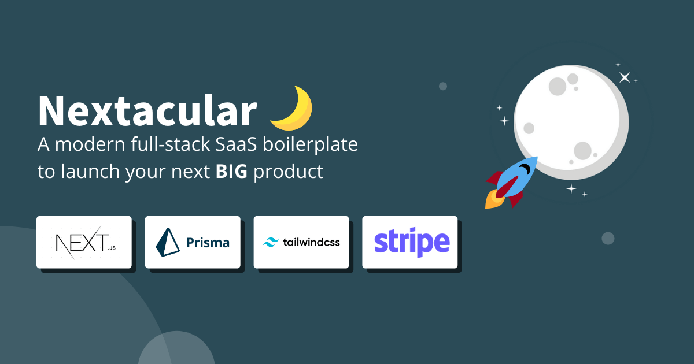

# Nextacular🌙

## Quickly launch multi-tenant SaaS applications

An open-source starter kit that will help you build full-stack multi-tenant SaaS platforms efficiently and help you focus on developing your core SaaS features. Built on top of popular and modern technologies such as Next JS, Tailwind, Prisma, and Stripe

## **Help Ukraine 🇺🇦 Win**

Take a look at the different ways you can [help Ukraine win](https://helpukrainewin.org)

## Live Demo

Nextacular Demo: [https://demo.nextacular.co](https://demo.nextacular.co)

## Documentation

Nextacular Documentation: [https://docs.nextacular.co](https://docs.nextacular.co)

## Outstanding Features

- 🔐 Authentication
- 💿 Database Integration + Prisma (SQL/PostgreSQL)
- 🤝 Teams & Workspaces
- ☁ Multi-tenancy Approach
- 📜 Landing Page
- 💸 Billing & Subscription
- 📱 Simple Design Components & Mobile-ready
- 🔍 SEO Support
- 👾 Developer Experience
- 💌 Email Handling

## Tech Stack

### Primary

- [Next.JS](https://nextjs.org)
- [Tailwind CSS](https://tailwindcss.com)
- [Prisma](https://prisma.io)
- [Stripe](https://stripe.com)
- [Vercel](https://vercel.com)

## Dependencies

- Headless UI - 1.4.2
- Hero Icons - 1.0.5
- Date FNS - 2.28.0
- Express Validator - 6.14.0
- Micro - 9.3.4
- Next Themes - 0.0.15
- Nodemailer - 6.7.2
- React Copy to Clipboard - 5.0.4
- React Google Analytics - 3.3.0
- React Hot Toast - 2.2.0
- React Top Bar Progress Indicator - 4.1.0
- Slugify - 1.6.5
- SWR - 1.2.1
- Validator - 13.7.0

## Project Roadmap

Nextacular's Previous and Upcoming Features: [https://github.com/arjayosma/nextacular/projects/1](https://github.com/arjayosma/nextacular/projects/1)

## Sponsors

Your company name could be here. If you wish to be listed as a sponsor, reach out to [arjay.osma@gmail.com](mailto:arjay.osma@gmail.com)

## Contributing

Want to support this project?

1. Consider purchasing from our marketplace (soon)
2. Subscribe to our newsletter. We send out tips and tools for you to try out while building your SaaS
3. If you represent company, consider becoming a recurring sponsor for this repository
4. Submit issues and features. Fork the project. Give it some stars. Join the discussion
5. Share Nextacular with your network

Read the [guidelines](CONTRIBUTING.md) for contributing

## License

All code in this repository is provided under the [MIT License](LICENSE)

## Appreciation

🙏 Happy to have the support of early adopters and supporters over at [Gumroad](https://arjayosma.gumroad.com/l/nextacular), [Github](https://github.com/arjayosma/nextacular), [Twitter](https://twitter.com/nextacular), and through personal email. Lots of plans moving forward. Thanks to you guys!
